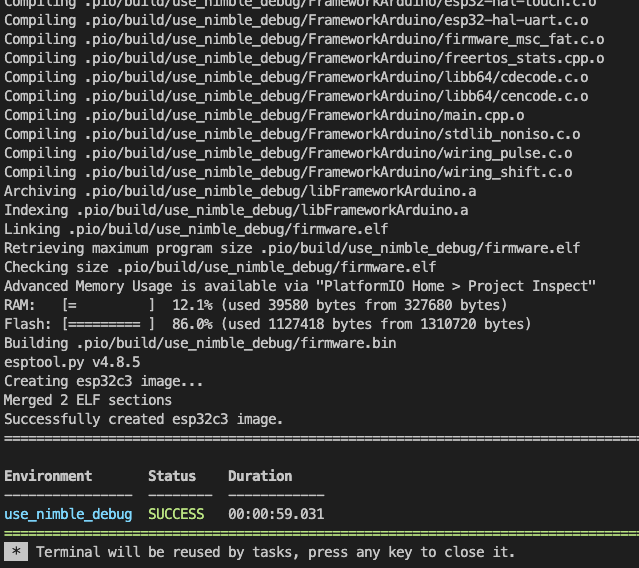
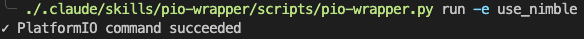
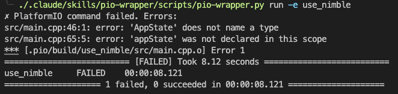
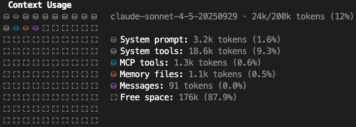
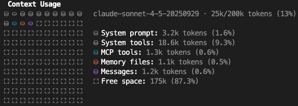
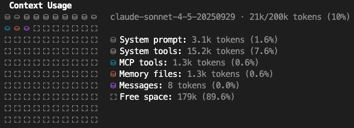
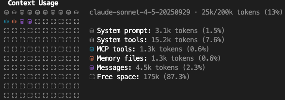
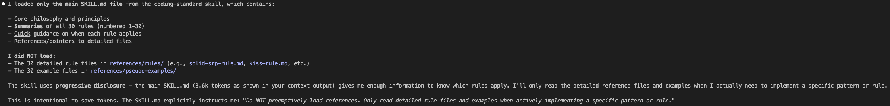

# Skills Repository

A collection of reusable skills for agentic tools (including Claude Code) that extend their capabilities with specialized knowledge and workflows. Keeping optimal token consumtion and preventing context pollution.

## Purpose

This repository serves as a central location for developing, packaging, and distributing skills for agentic tools (including Claude Code). Skills are modular packages that provide agents (including Claude) with domain-specific knowledge, tools, and workflows.

**Why not MCP, for some of these:** MCP takes a lot of context anyway. The lazy loading scenario is still not standardized and not easy to achieve. Even with lazy loading, until there's a way to only load up a specific method from MCP, MCP is still a context bloater.

## Available Skills

### skill-creator
**Purpose:** Create new skills in a systematic way

**Provider:** Anthropic

**Usage:** Used within this repository to develop new skills. Provides guidance, templates, and utilities for skill creation and packaging.

### pio-wrapper
**Purpose:** Filters PlatformIO CLI output to reduce token usage

**Usage:** Copy to your actual projects. Use either:
- The skill folder from `.claude/skills/pio-wrapper/`
- The packaged file `skillPackages/pio-wrapper.skill`

Returns success confirmations on successful builds and only error lines on failures, dramatically reducing context consumption.

Instead of a lots of build log, that waste tokens

The agent receives minimal and exactly the required information, saving tokens.

**Token usage** Approximately 600 tokens with claude code.

**Before skill is loaded**

**After skill is loaded**

### coding-standard
**Purpose:** Expert guidance for SOLID principles, Clean Code patterns, and design patterns

**Usage:** Copy to your actual projects. Use either:
- The skill folder from `.claude/skills/coding-standard/`
- The packaged file `skillPackages/coding-standard.skill`

Provides proactive guidance when designing classes, implementing features, refactoring code, or writing functions.

**Token usage:** Approximately 3.6k tokens with claude code (.claude/skills/coding-standard/skill.md). This skill uses progressive disclosure. The skill.md provides enough information. Most of the cases, the detailed rule and example file wont be necessary to load.

**Before skill is loaded**

**After skill is loaded**

## Getting Started

1. **To use a skill in your project:**
   - Copy the skill folder to your project's `.claude/skills/` directory, or
   - Import the `.skill` package file from `skillPackages/`

2. **To create a new skill:**
   - See `CLAUDE.md` for detailed instructions on using the skill-creator utilities

## License

- **skill-creator**: Apache License 2.0 (see `.claude/skills/skill-creator/LICENSE.txt`)
- **Other skills**: Check individual skill directories for license information
