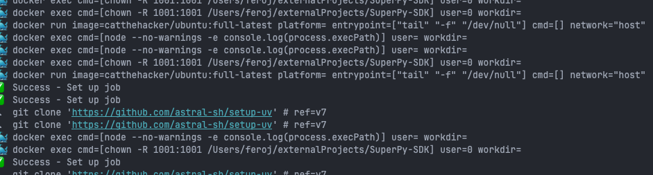
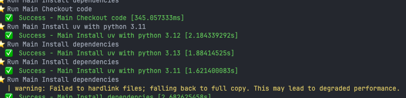
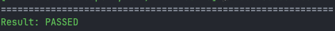
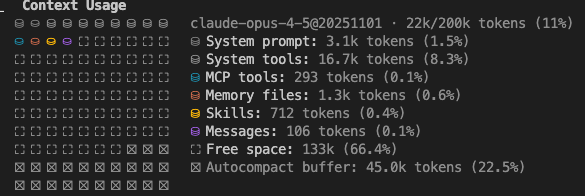
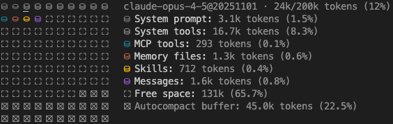
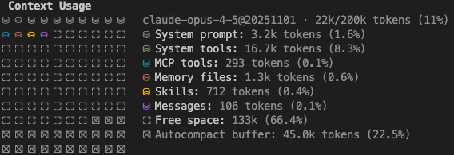
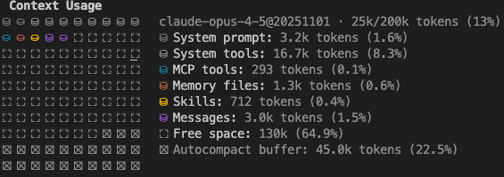
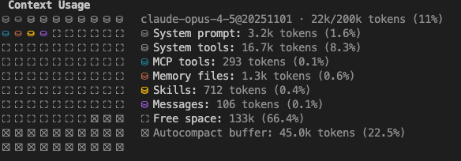
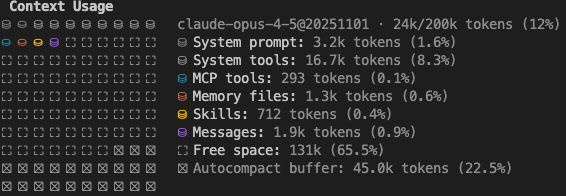

# Skills Repository

A collection of reusable skills for agentic tools (including Claude Code) that extend their capabilities with specialized knowledge and workflows. Keeping optimal token consumtion and preventing context pollution.

## Purpose

This repository serves as a central location for developing, packaging, and distributing skills for agentic tools (including Claude Code). Skills are modular packages that provide agents (including Claude) with domain-specific knowledge, tools, and workflows.

**Why not MCP, for some of these:** MCP takes a lot of context anyway. The lazy loading scenario is still not standardized and not easy to achieve. Even with lazy loading, until there's a way to only load up a specific method from MCP, MCP is still a context bloater.

## Available Skills

### skill-creator
**Purpose:** Create new skills in a systematic way

**Provider:** Anthropic

**Usage:** Used within this repository to develop new skills. Provides guidance, templates, and utilities for skill creation and packaging.

### pio-wrapper
**Purpose:** Filters PlatformIO CLI output to reduce token usage

**Usage:** Copy to your actual projects. Use either:
- The skill folder from `.claude/skills/pio-wrapper/`
- The packaged file `skillPackages/pio-wrapper.skill`

Returns success confirmations on successful builds and only error lines on failures, dramatically reducing context consumption.

Instead of a lots of build log, that waste tokens

The agent receives minimal and exactly the required information, saving tokens.

**Token usage** Approximately 600 tokens with claude code.

**Before skill is loaded**

**After skill is loaded**

### coding-standard
**Purpose:** Expert guidance for SOLID principles, Clean Code patterns, and design patterns

**Usage:** Copy to your actual projects. Use either:
- The skill folder from `.claude/skills/coding-standard/`
- The packaged file `skillPackages/coding-standard.skill`

Provides proactive guidance when designing classes, implementing features, refactoring code, or writing functions.

**Token usage:** Approximately 3.6k tokens with claude code (.claude/skills/coding-standard/skill.md). This skill uses progressive disclosure. The skill.md provides enough information. Most of the cases, the detailed rule and example file wont be necessary to load.

**Before skill is loaded**

**After skill is loaded**

### act-wrapper
**Purpose:** Run GitHub Actions workflows locally using nektos/act with filtered output

**Usage:** Copy to your actual projects. Use either:
- The skill folder from `.claude/skills/act-wrapper/`
- The packaged file `skillPackages/act-wrapper.skill`

Filters ACT's infrastructure noise (docker operations, action cloning, internal commands) while preserving all actual workflow output. Language and ecosystem agnostic. With colors!

Instead of verbose ACT output with docker operations and internal commands

The agent receives clean, filtered output showing only relevant workflow information.

At the end, conclusion is printed.

**Token usage:** Approximately 2k tokens with Claude Code.

**Before skill is loaded**

**After skill is loaded**

### architecture-patterns
**Purpose:** Implement proven backend architecture patterns including Clean Architecture, Hexagonal Architecture, and Domain-Driven Design

**Usage:** Copy to your actual projects. Use either:
- The skill folder from `.claude/skills/architecture-patterns/`
- The packaged file `skillPackages/architecture-patterns.skill`

Provides guidance when designing new backend systems, refactoring monolithic applications, establishing architecture standards, migrating to loosely coupled architectures, implementing DDD principles, or planning microservices decomposition.

**Token usage:** Approximately 3k tokens with Claude Code.

**Before skill is loaded**

**After skill is loaded**

### systematic-debugging
**Purpose:** Systematic debugging methodology for finding root causes before proposing fixes

**Usage:** Copy to your actual projects. Use either:
- The skill folder from `.claude/skills/systematic-debugging/`
- The packaged file `skillPackages/systematic-debugging.skill`

Enforces a four-phase debugging process: Root Cause Investigation, Pattern Analysis, Hypothesis and Testing, and Implementation. Use when encountering any bug, test failure, or unexpected behavior.

**Core principle:** ALWAYS find root cause before attempting fixes. Symptom fixes are failure.

[Reference](https://github.com/obra/superpowers/blob/main/skills/systematic-debugging/SKILL.md)

### typescript-standards
**Purpose:** TypeScript coding standards, patterns, and best practices for writing type-safe, maintainable code

**Usage:** Copy to your actual projects. Use either:
- The skill folder from `.claude/skills/typescript-standards/`
- The packaged file `skillPackages/typescript-standards.skill`

Provides guidance when writing TypeScript code, refactoring JavaScript to TypeScript, implementing type-safe patterns, working with advanced types, or building type-safe APIs. This skill uses progressive disclosure with detailed reference files for conventions, patterns, advanced types, and modern TypeScript patterns.

**Token usage:** Approximately N tokens with Claude Code (.claude/skills/typescript-standards/SKILL.md). This skill uses progressive disclosure with reference files loaded as needed.

**Before skill is loaded**

**After skill is loaded**

## Getting Started

1. **To use a skill in your project:**
   - Copy the skill folder to your project's `.claude/skills/` directory, or
   - Import the `.skill` package file from `skillPackages/`

2. **To create a new skill:**
   - See `CLAUDE.md` for detailed instructions on using the skill-creator utilities

## License

- **skill-creator**: Apache License 2.0 (see `.claude/skills/skill-creator/LICENSE.txt`)
- **Other skills**: Check individual skill directories for license information
